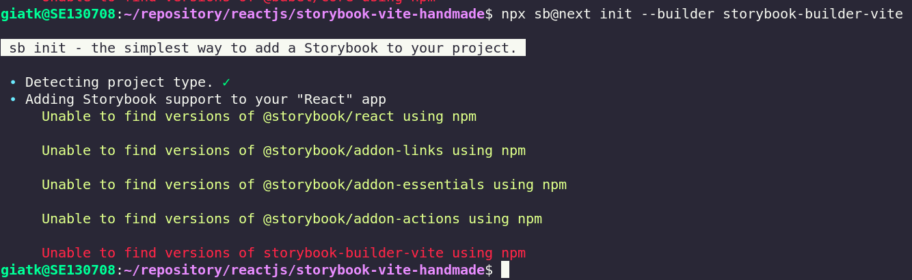
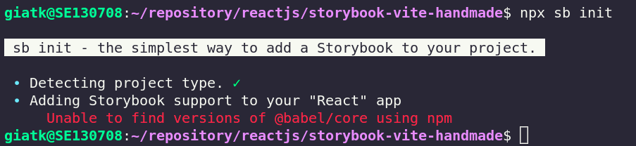
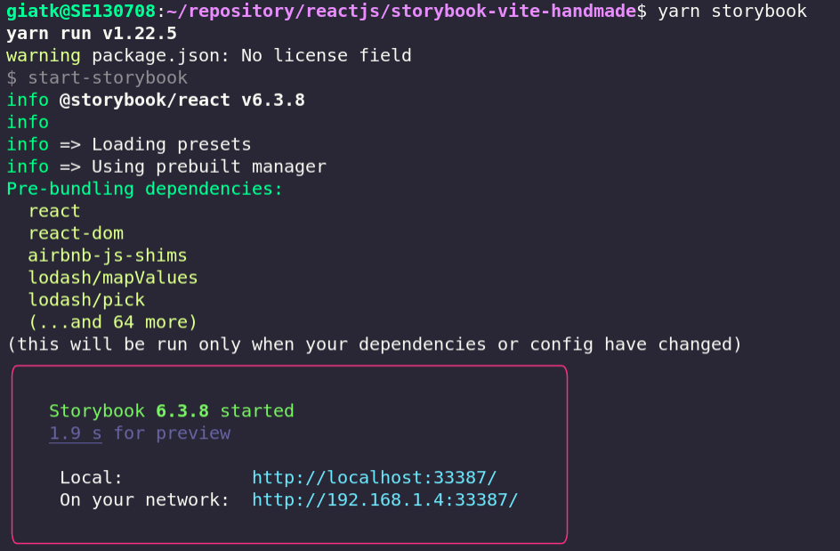
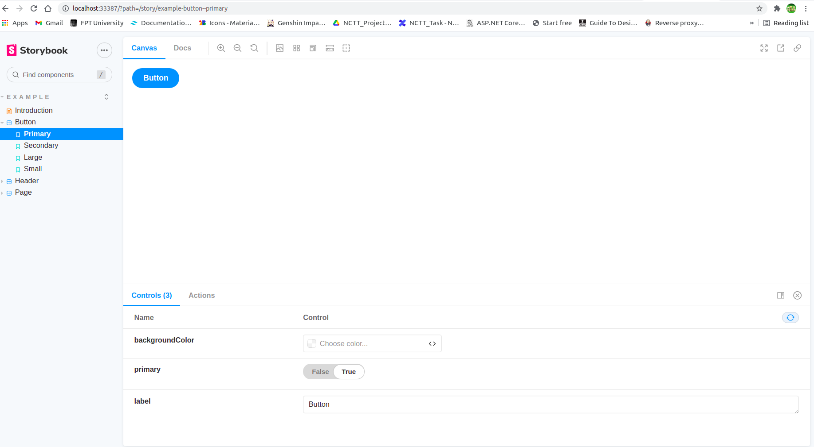

# How to integrate storybook with vite build tool?

This guideline for somebody who has failed on using `npx sb@next init --builder storybook-builder-vite`.



### 1. Create vite app if not existed

```bash
npm init vite
```

### 2. Restore package

`npm install` or `yarn`

### 3. Install storybook to project

Requirement:

* **Vite 2.4** or newer

Now, we will install require packages of storybook, which is failed on `npx sb@next init...`

They includes:

- @storybook/react (I use react-ts template for this project, you can change it to match with your project)

- @storybook/addon-links

- @storybook/addon-essentials

- @storybook/addon-actions

- storybook-builder-vite

```bash
yarn add @storybook/react @storybook/addon-links @storybook/addon-essentials @storybook/addon-actions storybook-builder-vite
```

### 4. Generate storybook templates

Run command `npx sb init` to generate storybook template or you can copy them (`.storybook` and `stories` folder) from this project to your project.



This ok!

### 5. Config to use vite instead of webpack.

Open *.storybook/main.js*, add config:

```javascript
// .storybook/main.js
module.exports = {
// ...
  core: {
    builder: 'storybook-builder-vite',
  },
  async viteFinal(config, { configType }) {
    // customize the Vite config here
    return config;
  },
}
```
### 6. Add storybook script.

Open *src/package.json*, add script:

```json
"scripts": {
    "sb": "start-storybook",
    "build-sb": "build-storybook"
  },
```

Default, storybook run on dynamic port, for using fixed port, we need add param `p <port>`, example: `start-storybook -p 9000`.

### 7. Run storybook on hack speed

```bash
yarn sb
```





## References

https://github.com/eirslett/storybook-builder-vite

https://storybook.js.org/docs/react/get-started/install
